# MCMC Plots

This includes a comparison of the Posterior and the profile Likelihood shape in 
the middle column. 
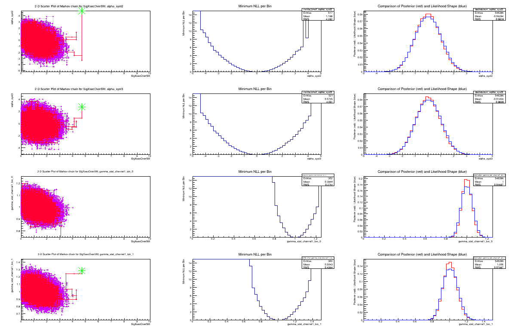

NLL time development. 
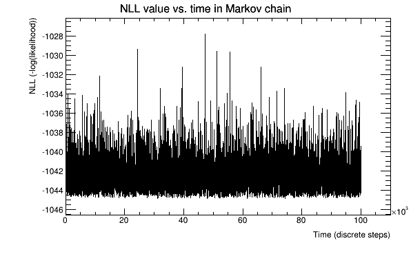

Parameter time development (1000 sampling points). 
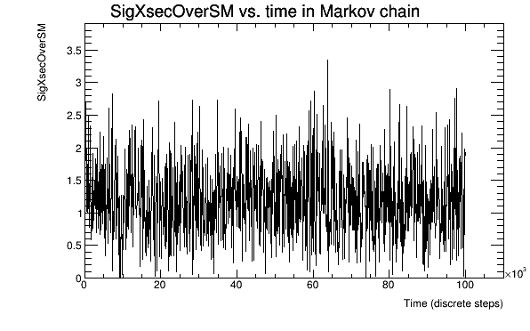

Parameter time development (all sampling points). 
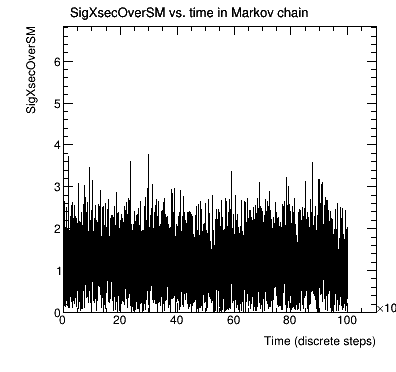

# Sequential Proposal

Running the Standard configuration of MCMC and SequentialProposal(10.0). 
<!--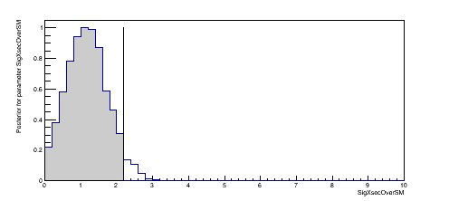-->
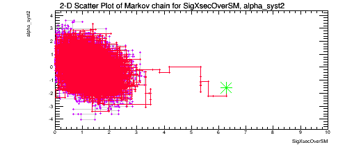

Changing to SequentialProposal(100.0). 
<!--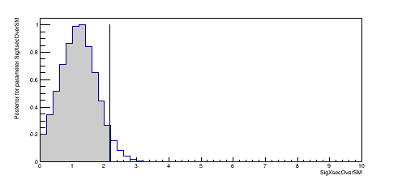-->
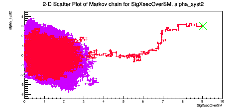

Now, using the standard SequentialProposal(10.0), let's look at various values of 
the "oversampling". This is oversampling=3. 
<!--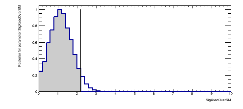-->
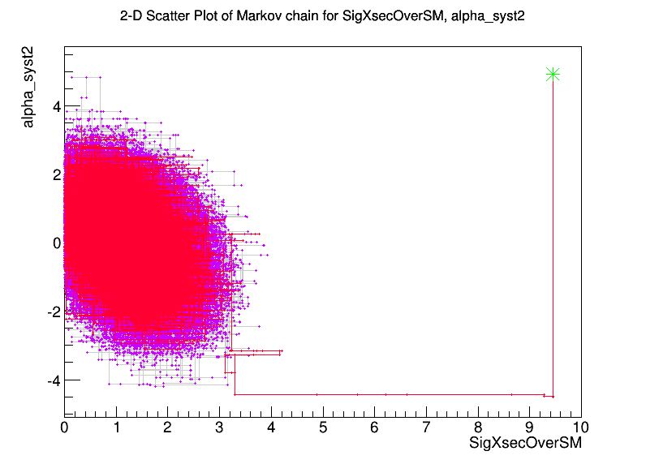

And oversampling=10. 
<!--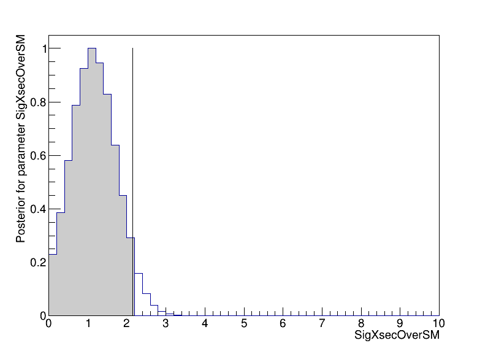-->
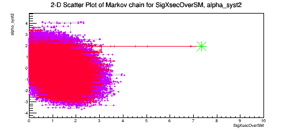

Work in progress.
