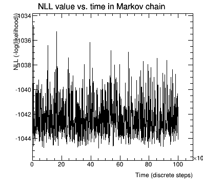
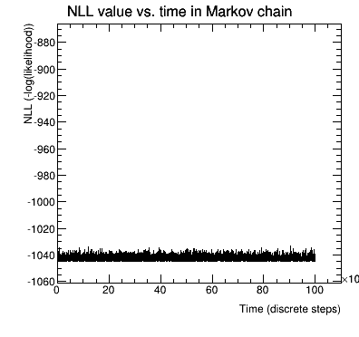
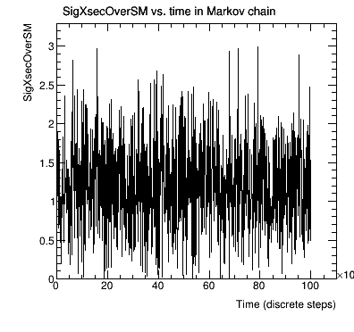
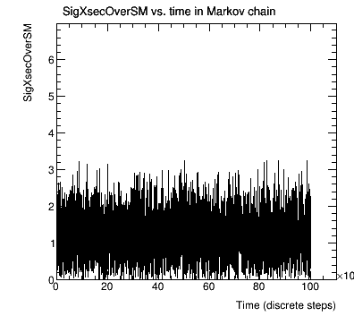
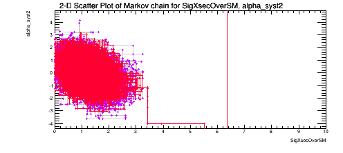
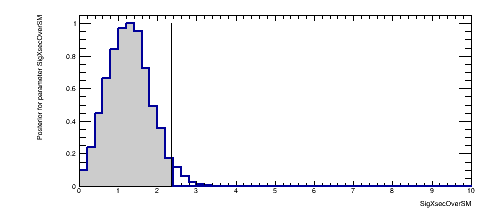
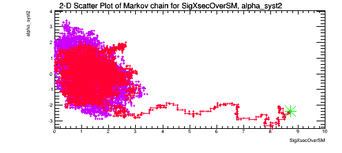
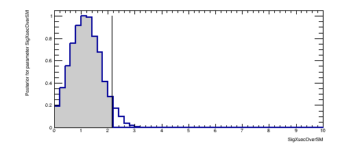
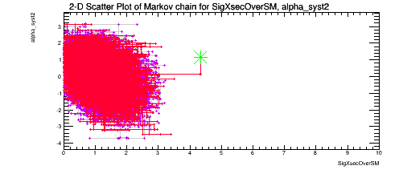
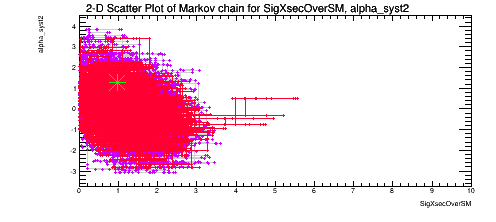

# MCMC Plots

This includes a comparison of the Posterior and the profile Likelihood shape in 
the middle column. 

NLL time development with 1000 sampling points (left) and all sampling points (right). 

Parameter time development with 1000 sampling points (left) and all sampling points (right). 

# Sequential Proposal

Running the Standard configuration of MCMC and SequentialProposal(10.0). 
<!---->

Changing to SequentialProposal(100.0). 
<!---->

Now, using the standard SequentialProposal(10.0), let's look at various values of 
the "oversampling". This is oversampling=3. 
<!---->

And oversampling=10. 
<!---->

Work in progress.
